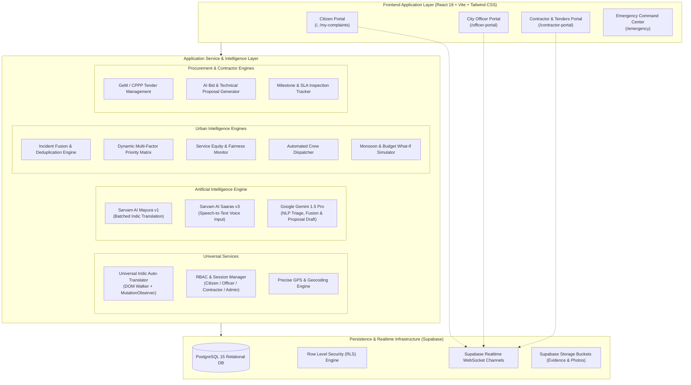
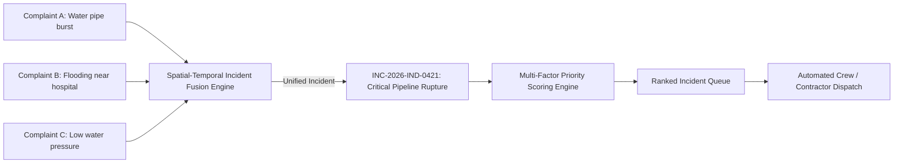
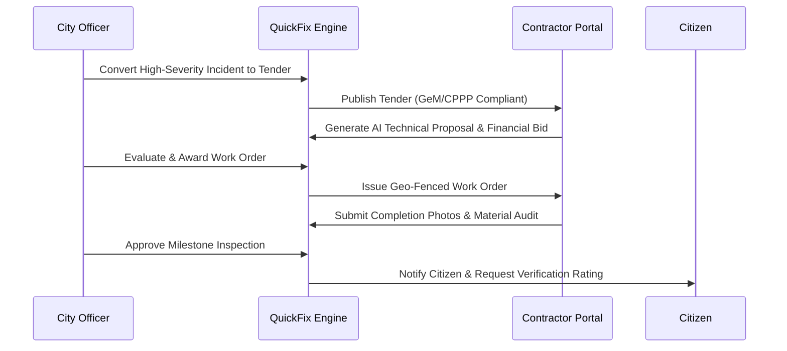
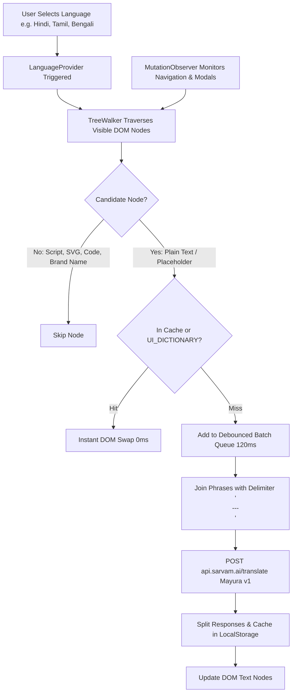
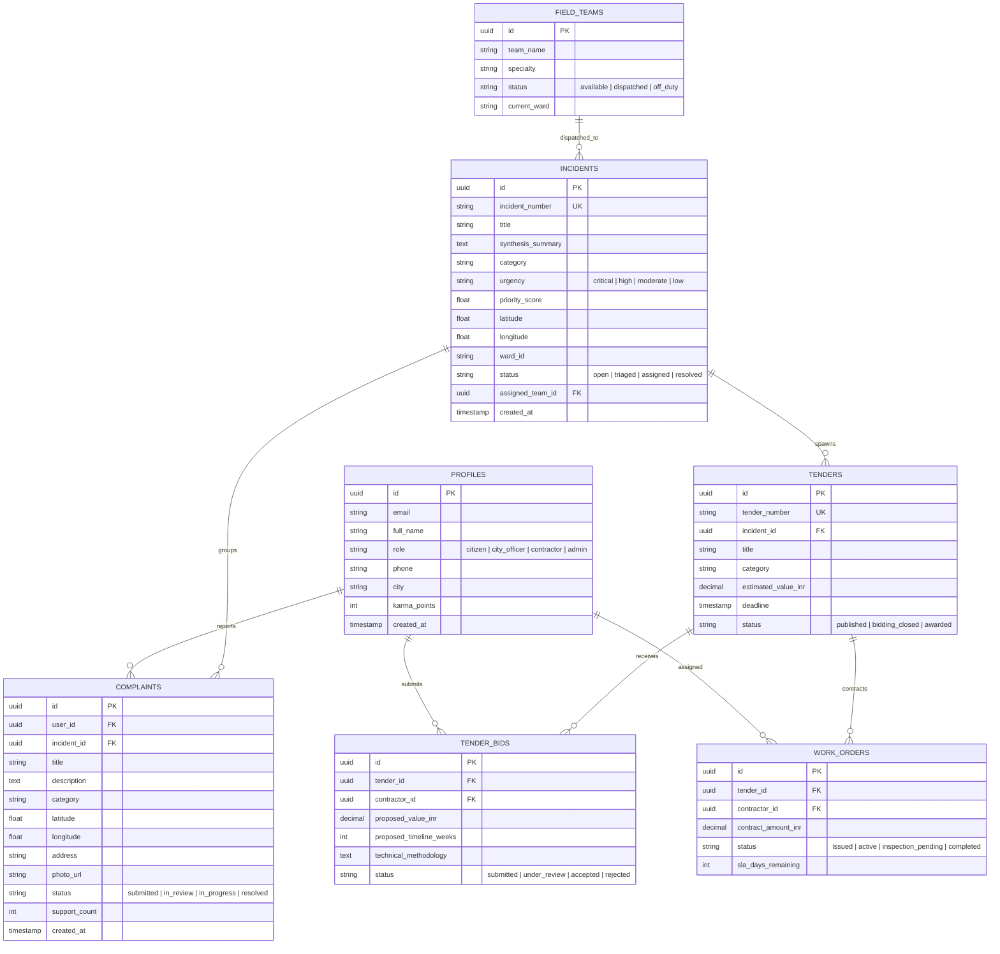

# QuickFix: Urban Intelligence & Civic Governance Platform
## System Architecture & Technical Specification Document

---

## 1. Executive Summary & Vision

**QuickFix** is an AI-orchestrated civic governance and urban infrastructure platform designed to bridge the gap between citizens, municipal administrators, and public contractors. Rather than acting as a simple complaint ticketing system, QuickFix functions as an **Urban Operating System (Urban OS)** that ingests unstructured citizen reports, unifies redundant complaints into singular municipal incidents, mathematically prioritizes work orders by human life-safety and socio-economic equity, and orchestrates government tenders and contractor accountability.

### Core Objectives
1. **Intelligent Ingestion**: Eliminate duplicate municipal dispatches through automated spatial-temporal Incident Fusion.
2. **Data-Driven Prioritization**: Replace "first-come, first-served" ticket queues with multi-factor risk assessment models.
3. **Transparent Public Contracting**: Connect civic issues directly to government procurement tenders, contractor milestone verification, and citizen auditability.
4. **Inclusive Governance**: Provide end-to-end Indic multilingual accessibility across 10 official languages using Sarvam AI.

---

## 2. High-Level System Architecture



---

## 3. Subsystem Breakdown

### 3.1. Citizen Experience Subsystem (`/`, `/my-complaints`)
The citizen interface empowers public residents to report issues, verify geographic positions, and track resolutions with complete transparency.

* **Multimodal Intake**:
  * **Voice Intake**: Citizen voice input in regional dialects transcribed into text via Sarvam AI Saaras v3 (`transcribeWithSarvam`).
  * **Live GPS Pinpointing**: Automated geofencing with high-accuracy browser geolocation and reverse-geocoded landmark resolution.
  * **Visual Proof**: Mandatory photo attachment stored on Supabase Storage with cryptographic hashing.
* **Civic Feed & Social Prioritization**:
  * Public feed with **Support (+1)**, **Repost**, and threaded community comments.
  * Increased public support dynamically increments the incident density weight in the prioritization matrix.
* **Citizen Audit Tracker (`/my-complaints`)**:
  * End-to-end timeline showing: `Submitted` -> `AI Fused` -> `Assigned to Field Crew / Contractor` -> `Inspection Complete` -> `Resolved`.
  * Post-resolution citizen rating and feedback mechanism.

---

### 3.2. Urban Intelligence & City Officer Command Subsystem (`/officer-portal`)
Built for city commissioners, municipal engineers, and emergency dispatchers to triage thousands of concurrent urban hazards.



#### A. Incident Fusion Engine (`incidentFusion.ts`)
Individual complaints within a $150\text{m}$ radius occurring within a 48-hour window are evaluated using semantic text cosine similarity and geographic Haversine distance. When similarity exceeds the clustering threshold ($\tau \ge 0.78$), the reports are synthesized into a **Unified Incident**.
* Prevents sending multiple maintenance trucks to the same burst pipe or sinkhole.
* Retains parent-child relational links allowing all contributing citizens to receive simultaneous status notifications.

#### B. Dynamic Multi-Factor Priority Matrix (`priorityEngine.ts`)
The priority score ($S \in [0, 100]$) is computed mathematically:

$$S = w_u \cdot U + w_v \cdot V + w_w \cdot W + w_d \cdot D$$

Where:
* **$U$ (Urgency Score, 40%)**: Category-specific baseline severity (e.g., Live High Voltage Wire = 100, Major Water Main = 85, Pothole = 55, Graffiti = 20).
* **$V$ (Vulnerability Score, 25%)**: Proximity to vulnerable infrastructure (Hospitals, Schools, Transit Hubs, Slum areas).
* **$W$ (Wait Time Decay, 20%)**: Age of unresolved issue relative to municipal SLA standards ($W = \min(100, \frac{\Delta t}{\text{SLA}} \times 50)$).
* **$D$ (Density & Public Amplification, 15%)**: Logarithmic scaling of unique citizen complaints and community support votes ($D = \min(100, 20 \cdot \ln(1 + N_{\text{complaints}}))$).

#### C. Service Equity & Fairness Monitor (`fairnessEngine.ts`)
* Analyzes resolution latency across municipal wards to prevent demographic bias or affluent-ward prioritization.
* Calculates the **Municipal Equity Index Score** (0–100) using variance and Gini coefficients across wards. Alerts administrators if underserved wards experience wait times $>1.5\sigma$ above the city mean.

#### D. What-If Scenario Simulator (`whatIfSimulator.ts`)
* Enables officers to model changes in municipal budget allocations, heavy rainfall/monsoon surges, and crew availability to forecast backlog shifts and queue clearance times.

#### E. Open311 GeoReport v2 Compliance (`open311.ts`)
* Generates standard Open311 XML/JSON payloads enabling interoperability with state-level smart city integrated command and control centers (ICCC).

---

### 3.3. Contractor & Government Tender Subsystem (`/contractor-portal`)
Integrates the municipal maintenance supply chain directly into the platform, closing the loop from complaint to physical repair.



#### A. Contractor Identity & Verification
* Profile management capturing **MSME Registration**, **GSTIN**, **GeM / CPPP Vendor IDs**, and certified service categories (Roads, Drainage, Electrical, Sanitation).
* Strict role-based verification status gating tender bidding permissions.

#### B. Generative AI Proposal Generator (`tenderDraftService.ts`)
* Leverages LLM prompt pipelines to generate formal, audit-ready technical execution proposals tailored to public tender specifications.
* Includes:
  * Proposed engineering methodology and equipment deployment.
  * Milestone breakdown and Gantt schedule estimation.
  * Compliance clause explanation in plain language.
  * Direct client-side compilation and export to **Microsoft Word (.docx)** and **Adobe PDF (.pdf)** formats.

#### C. Work Order Milestone & SLA Tracking
* Geo-fenced milestone tracking ensuring contractor crews upload tamper-evident evidence from the physical coordinates of the incident.
* Automated penalty calculations for SLA violations.

---

### 3.4. Universal Indic Multilingual Engine (Sarvam AI)
Enables friction-free accessibility across linguistically diverse populations without requiring full application re-writes.



#### Architectural Highlights:
1. **Universal DOM Auto-Translator (`LanguageContext.tsx`)**:
   * Uses browser native `TreeWalker` (`NodeFilter.SHOW_TEXT`) and `MutationObserver` to observe and translate **all visible content** across third-party components, charts, dialogs, and navigation menus.
   * Preserves original English strings in memory using `WeakMap<Node, string>` ensuring switching back to English is instantaneous and 100% loss-free.
2. **High-Throughput Delimiter Batching (`sarvamService.ts`)**:
   * Bundles up to 20–25 unique phrases into a single HTTP payload separated by ` \n---\n `.
   * Cuts network overhead by up to 90%, preventing API throttling and rate-limit starvation.
3. **Strict Brand Name Guarding (`BRAND_NAMES`)**:
   * Hardware-level preservation for the proprietary brand name **Quickfix** / **QuickFix**.
   * RegEx post-processing filters out any phonetic or literal Indic translations (e.g., *शीघ्र-समाधान* or *त्वरित समाधान*), ensuring the brand typography remains intact.
4. **Supported Language Matrix**:
   * Hindi (`hi-IN`), Marathi (`mr-IN`), Bengali (`bn-IN`), Gujarati (`gu-IN`), Tamil (`ta-IN`), Telugu (`te-IN`), Kannada (`kn-IN`), Malayalam (`ml-IN`), Punjabi (`pa-IN`), Odia (`od-IN`), and English (`en-IN`).

---

## 4. Database Schema & Data Models

The relational persistence tier is engineered in **PostgreSQL 15** hosted on Supabase, secured with declarative Row Level Security (RLS) policies.



---

## 5. Security & Authentication Architecture

### 5.1. Authentication Framework
* Built on **Supabase Auth** using cryptographically signed **JSON Web Tokens (JWT)**.
* Role claims are embedded within user session metadata and synchronized with `public.profiles`.

### 5.2. Row Level Security (RLS) Strategy
* **Citizen Access**:
  * Citizens can read public feeds, spatial maps, and their own complaints (`auth.uid() = user_id`).
  * Citizens cannot modify priority scores, incident status, or administrative overrides.
* **City Officer Access**:
  * Officers have elevated read/write access to incident management, crew dispatches, fairness indices, and tender issuance.
* **Contractor Access**:
  * Contractors can read published tenders and update their own submitted bids and work order milestones.
* **Zero Credential Exposure**:
  * Production secrets (Supabase service role keys, Sarvam API keys, Gemini API keys) are restricted to environment variables (`.env`) and excluded from source control via strict `.gitignore` rules.

---

## 6. Performance, Reliability & Scalability

1. **Progressive Web App (PWA) Offline Resilience**:
   * Uses **Workbox** service workers to cache essential UI bundles, static assets, and map tiles.
   * Emergency guidelines, CPR trainers, and helpline directories remain available when cellular connectivity is severed.
2. **Spatial Indexing**:
   * Geospatial coordinates are indexed using PostgreSQL GiST / PostGIS spatial indices for sub-10ms radial queries during Incident Fusion.
3. **Client-Side Optimization**:
   * Vite bundle code-splitting across heavy dependencies (`leaflet`, `html2canvas`, `jspdf`, `docx`).
   * Memory-safe DOM walking using `WeakMap` references to prevent memory leaks during real-time feed updates.
4. **WebSocket Push Infrastructure**:
   * Supabase Realtime channels push live incident status changes, SOS dispatches, and notification badges directly to active clients without repetitive HTTP polling.

---

## 7. Technology Stack Summary

| Layer | Technologies |
| :--- | :--- |
| **Frontend Framework** | React 18, TypeScript 5, Vite 7 |
| **Styling & Design System** | Tailwind CSS 3, Lucide React Icons, Radix UI Primitives, Sonner Toaster |
| **State & Context** | React Context API, TanStack React Query v5 |
| **Spatial & Mapping** | Leaflet, React-Leaflet, OpenStreetMap CartoDB tiles |
| **Indic Multilingual AI** | Sarvam AI API (`mayura:v1` Translation, `saaras:v3` Speech-to-Text) |
| **Cognitive Intelligence** | Google Gemini 1.5 Pro (via Google Generative AI SDK) |
| **Document Generation** | `docx` (Word), `jspdf` + `html2canvas` (PDF) |
| **Backend & Database** | PostgreSQL 15, Supabase Auth, Supabase Storage, Supabase Realtime |
| **Interoperability** | Open311 GeoReport v2 Specification |

---

## 8. Directory & Codebase Organization

```
QuickFix/
├── .github/                     # CI/CD Workflows
├── public/                      # Static assets, PWA manifest & service workers
├── src/
│   ├── components/
│   │   ├── chat/                # AI Citizen Assistant & ChatBot
│   │   ├── common/              # LanguageSelector & Shared Widgets
│   │   ├── complaints/          # Complaint cards, intake modals & location pickers
│   │   ├── dashboard/           # Citizen KPI cards, feeds & announcements
│   │   ├── emergency/           # Crisis command center & tactical views
│   │   ├── layout/              # Header, Sidebar, BottomNav
│   │   ├── ui/                  # Reusable accessible UI primitives (Radix)
│   │   └── urbanIntelligence/  # Officer Queue, Heatmap, What-If Simulator & Crew Dispatch
│   ├── contexts/
│   │   ├── AuthContext.tsx      # User authentication & RBAC state
│   │   └── LanguageContext.tsx  # Universal Indic DOM Auto-Translator
│   ├── pages/
│   │   ├── Index.tsx            # Main Citizen Portal
│   │   ├── OfficerPortal.tsx    # City Command & Urban Intelligence Dashboard
│   │   ├── ContractorPortal.tsx # Tenders, Bids & Work Orders
│   │   └── MyComplaints.tsx     # Citizen Public Tracking View
│   ├── services/
│   │   ├── contractorPortal/    # Tenders, Work Orders & AI Proposal Generator
│   │   ├── urbanIntelligence/   # Fusion, Priority, Fairness & Dispatch Engines
│   │   ├── translations/        # UI Dictionary for 11 Indic languages
│   │   ├── sarvamService.ts     # Sarvam Mayura v1 & Saaras v3 client
│   │   └── gemini.ts            # Google Gemini AI services
│   └── types/                   # TypeScript domain models
├── supabase/
│   └── migrations/              # SQL schema definitions & RLS policies
├── ARCHITECTURE.md              # This document
└── vite.config.ts               # Vite build & PWA configuration
```

---
*Document Version: 2.4.0 • Updated: October 2026 • Platform: QuickFix Civic Operating System*
